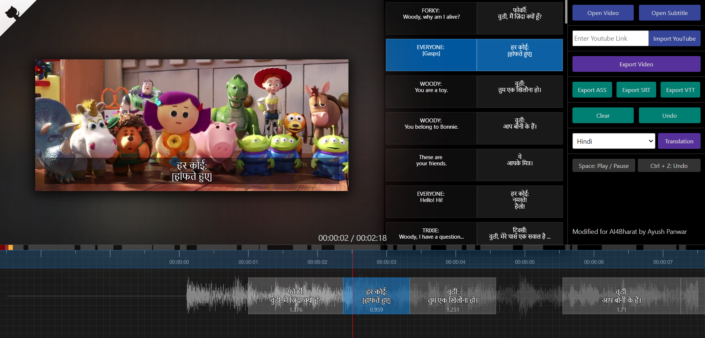

# SubPlayer

This is a fork of SubPlayer with added support for YouTube, Indic languages with transliteration, and original subtitle retention.

## Live Demo

[Vercel Deployment](https://subplayer-payyup.vercel.app/)

[Original](https://subplayer.js.org/)

## Usage

* Since the direct video link returned by the [public API](https://youtube-dl-utils-api.herokuapp.com/get_youtube_video_link_with_captions) does not respond with a 'Access-Control-Allow-Origin' header and returns an opaque response without CORS enabled, [this Google Chrome extension](https://chrome.google.com/webstore/detail/moesif-origin-cors-change/digfbfaphojjndkpccljibejjbppifbc) is needed to download the video from YouTube servers in order to ultimately export it after burning subtitles.

* Video cannot be exported until it's completely downloaded in the background.

* Persisted YouTube videos must be reimported to generate their waveforms. 

* COEP and COOP headers are enabled in order to use SharedArrayBuffer for FFmpeg.

* The fonts for subtitles are automatically changed based on their language. This is achieved by using multiple different fonts (namely Noto Sans).

* Subtitle language can be switched between English and translated Indic languages using a toggle. The selected language is then used upon export.

* Upon splitting a subtitle, only the language selected is split, while the other is duplicated. This is done to prevent incorrect splitting of the other language.

